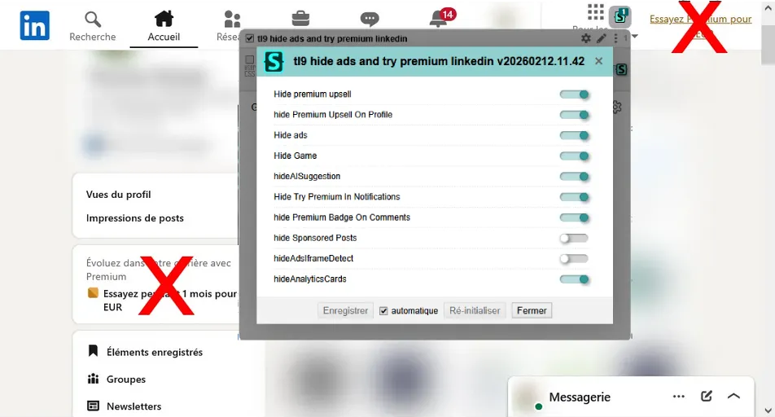

# Hide Ads and Premium mentions / upsell on LinkedIn

A userstyle written in UserCSS made for Stylus that hides game mentions, ads sections and try premium buttons.

The userstyle started with my frustration of seeing to much premium mentions on LinkedIn. I don't want to pay for LinkedIn Premium, and I don't want to play the games here.

## Installation

You can visit the userstyles.world homepage of this userstyle here :

https://userstyles.world/style/25558/tl9-hide-ads-and-try-premium-messages-linkedin

**If you have stylus installed**, you can install the userstyle with the following button :

|Miniature of the userstyle|Interface version 20260317.09.02|
|---|---|
|||

## Creation and update process

As I have the OpenStyles/Stylus extension installed on my browser, I first looked if existing userstyles could hide the premium mentions on LinkedIn. Because they didn't exist, I decided to do the work myself, and make the userstyle easy to use and available for all, for free.

### Why Stylus and CSS and not an extension

**- OpenStyles/Stylus has an existing userbase, and every function I need to make a configuration interface.**

Althought it is tempting to write a userscript, which is then very easy to make into an extension, I like how CSS is really easy to understand and flexible, and how I can add a config interface for all OpenStyles/Stylus users.

**- Easy to write**

I can write CSS rules from the web inspector and copy paste them directly into the Stylus editor. Althought LinkedIn encrypts their classnames, there still exists ways to select the elements I need (see the code of the userstyle if you're curious how it works)

And, the CSS rules work directly for every Stylus user, with minimum performance impact

**- Easy to update**

Stylus is well integrated with userstyles.world. And because I have an account, linked to my github account, I just have to write the changes, change the version number, and push the update. From the same editor I write my CSS rules in.

On the users side, they have the choice to update automaticly or manually ; read the code, add their custom CSS rules. Users have freedom.

**- Make it an extension ?**

If I wished to make an extension out of the userstyle, it would just be a wrapper for the Stylus extension suited only for my style, or else I would just be remaking Stylus.

The wrapper is not hard to make. As a matter of fact, perplexity was able to make it for me. I found the api link to fetch the updates, and from the api call, with javascript, it's possible to make the configuration interface.

I like to think it would be better for the users to use OpenStyles/Stylus. As this opensource extension is really easy to use, already working and made me curious about modifying pages in the first place. And there is a lot of userstyles they could discover for a lot of other pages.

## TODO / Roadmap

## V0 - Home

- [x] Hide home page premium mentions
- [x] Hide home page game mentions

## V1

- [x] Disable/enable filters from the stylus interface

### Extras

- [x] View complete profile descriptions

### Continuous

- [x] Hide all premium mentions everywhere, this task will never end as LinkedIn finds new places for their premium upsell

|Hiding Premium Mentions instead of paying|
|---|
||

## V2 - Mobile port

The web version of LinkedIn on mobile is cleaner, but it could use some work at various places.

- [ ] userscript port, so it can be used on browsers that only support userscripts
- [ ] Check how well Tampermonkey works on Safari mobile

## V3 - Extension port

- [x] Build the interface from the userCSS fetched from the API
  - [x] (Chrome version working thanks to Perplexity)
  - [ ] Firefox version ?
- [ ] user can add new filters
  - [ ] textarea to paste the css
  - [ ] save the css in the extension storage
  - [ ] export the user filters

**Userstyle route** (easier to publish updates directly from stylus)
- [x] Fetches the style updates from the api link https://userstyles.world/api/style/25558
- [x] pull the style from userstyles on update

**GITHUB route**
- [ ] mirror the userstyles updates on github
- [ ] publish the style on github
- [-] pull the style from github on update 

